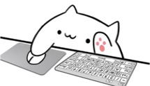

# BongoCat



BongoCat is a native macOS desktop companion that reacts to keyboard, pointer, mouse, and game controller input.
It uses SwiftUI, AppKit, Metal, and Live2D Cubism without a WebView, JavaScript runtime, or Rust runtime.

**macOS 26+ · Swift · AppKit · Metal · MIT**

## Local comparison

A 30-second idle release snapshot on an Apple M3 Pro running macOS 27.0 beta produced these results:

| Build | Processes | CPU | RSS | App size |
| --- | ---: | ---: | ---: | ---: |
| Native `0.0.1` | 1 | 0.0% | 135 MB | 10 MB |
| Upstream Tauri `1.1.0` at `44f44bc` | 5 | 35.4% | 347 MB | 13 MB |

These numbers are a local snapshot, not a guarantee for every Mac.

## Requirements

- macOS 26 or newer.
- Xcode 26 or newer with Command Line Tools selected.
- [CMake](https://cmake.org/download/).
- [Live2D Cubism SDK for Native 5 R5](https://www.live2d.com/en/sdk/download/native/).

Live2D Cubism Core and Framework are not included in this repository.
Download the SDK from Live2D and accept its license before building.

## Clone and run

```sh
git clone https://github.com/hskl18/BongoCat.git
cd BongoCat
brew install cmake
export CUBISM_SDK_ROOT="/path/to/CubismSdkForNative-5-r.5"
./scripts/dev-local.sh up
```

The launcher checks the SDK, builds the current Mac architecture, creates `build/BongoCat.app`, applies a local signature, and starts the app.
The first launch places the cat 24 points from the lower-right edge of the main screen.
Building and running BongoCat does not require administrator access.

Grant BongoCat access in System Settings > Privacy & Security > Input Monitoring when macOS asks.
macOS may request account authentication when this privacy setting changes.
Run `./scripts/dev-local.sh restart` after changing the permission.

## Commands

```sh
./scripts/dev-local.sh up       # build and start
./scripts/dev-local.sh restart  # rebuild and restart
./scripts/dev-local.sh down     # stop this checkout's app
./scripts/dev-local.sh status   # show the running process
./scripts/dev-local.sh logs     # show recent logs
./scripts/dev-local.sh test     # build Cubism and run Swift tests
./scripts/check-repository.sh   # check public-repo hygiene
```

Ad-hoc signing works for a first local run.
To keep Input Monitoring permission stable across rebuilds, install OpenSSL 3 and create a reusable local certificate:

```sh
brew install openssl@3
./scripts/setup-local-signing.sh
./scripts/dev-local.sh restart
```

This certificate stays on your Mac and does not require an Apple Developer account.
The optional setup can display Keychain or certificate trust prompts.

## Source-only project

This repository does not publish an app bundle, DMG, Developer ID signature, notarized build, updater, or Live2D SDK files.
Each developer builds and runs the app on their own Mac.

See [docs/PARITY.md](docs/PARITY.md) for the upstream behavior map.
See [THIRD_PARTY_NOTICES.md](THIRD_PARTY_NOTICES.md) for upstream and Live2D attribution.

## License

BongoCat source code is available under the [MIT License](LICENSE).
Live2D software remains subject to Live2D's licenses.
